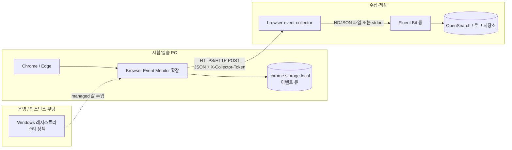

# browser-event-monit

Chromium 기반 브라우저(Chrome, Edge 등)에서 **탭·탐색·창 포커스** 같은 이벤트를 수집해, 로컬 또는 사내 **collector HTTP API**로 보내는 구성입니다. 수집기는 NDJSON으로 적재하고, Fluent Bit 등으로 OpenSearch 등으로 넘기는 용도를 가정합니다.

## 전체 아키텍처



### 역할 요약

| 구분 | 역할 |
|------|------|
| **확장 프로그램** | `tabs` / `webNavigation` / `windows` 이벤트를 구독해 페이로드 생성, 큐에 쌓았다가 주기적으로 collector로 POST |
| **관리 정책** | CRX를 바꾸지 않고 수집 URL, 수험자(세션) ID, 토큰을 OS 정책으로 주입 (`chrome.storage.managed`) |
| **collector** | 단일 HTTP 수집 API, NDJSON 출력·토큰 검증 등 ([collector/README.md](collector/README.md)) |
| **Fluent Bit** (선택) | NDJSON tail 후 OpenSearch 등으로 전달 |

## 구성 요소

### 1. 확장 프로그램 (`extension/`)

- **Manifest V3**, 백그라운드 서비스 워커에서 이벤트 처리
- **로컬 큐**: 전송 실패 대비해 `chrome.storage.local`에 이벤트 큐 유지 후 flush
- **설정**: `lib/config.js`에서 `getConfig()` 호출 시 **`chrome.storage.managed`**와 코드 기본값을 합쳐 사용
- **스키마**: `schema.json` + `manifest.json`의 `storage.managed_schema` — 기업 정책으로 허용되는 키를 선언

### 2. 수집기 (`collector/`)

Node 기반 HTTP 서버. 실행 방법·환경 변수·Fluent Bit 예시는 **[collector/README.md](collector/README.md)** 를 참고하면 됩니다.

## 설정이 적용되는 방식

### 개발·로컬 기본값

`getConfig()`의 기본값(예: `collectorUrl`, `candidateId`, `collectorToken`의 출발점)은 코드와 `lib/constants.js`의 `DEFAULT_TOKEN` 등에 정의되어 있습니다.

### 운영: 관리 스토리지(Enterprise)

`chrome.storage.managed`는 **디스크에 있는 확장 전용 DB가 아니라**, 브라우저 **정책 시스템**이 OS에서 읽은 값을 확장에 **읽기 전용**으로 노출하는 API입니다.

1. 관리자(또는 VM userdata)가 **레지스트리** 등에 정책을 기록합니다.
2. Chrome/Edge가 기동 시 정책을 로드하고, `managed_schema`와 맞는 키만 검증합니다.
3. 확장이 `chrome.storage.managed.get(...)`으로 그 값을 읽습니다. 확장 코드는 managed 값을 쓸 수 없습니다.

Windows에서 이 프로젝트가 사용하는 **3rd-party 확장 정책 경로** 예시는 다음과 같습니다(`<EXTENSION_ID>`는 배포 중인 확장 ID).

- Chrome: `HKLM\SOFTWARE\Policies\Google\Chrome\3rdparty\extensions\<EXTENSION_ID>\policy`
- Edge: `HKLM\SOFTWARE\Policies\Microsoft\Edge\3rdparty\extensions\<EXTENSION_ID>\policy`

정책으로 넘길 수 있는 키 이름은 `extension/schema.json`에 정의되어 있으며, 코드에서는 다음과 같이 매핑됩니다.

| 정책 키 (managed) | 용도 |
|-------------------|------|
| `collectorUrl` | 이벤트 POST 대상 URL |
| `candidateId` | 이벤트 JSON의 `candidate_id` 등 식별자 |
| `collectorToken` | 요청 헤더 `X-Collector-Token` (미설정 시 코드 기본 토큰 사용 가능) |

같은 확장 ID로 **ExtensionInstallForcelist** 등으로 CRX를 강제 설치하고, 위 `policy` 키만 인스턴스마다 바꾸면 **CRX 재빌드 없이** 환경별 설정이 가능합니다.

## 디렉터리 구조

```
browser-event-monit/
├── extension/          # MV3 확장 소스
│   ├── manifest.json
│   ├── schema.json     # managed_storage 스키마
│   ├── background.js
│   └── lib/
├── collector/          # NDJSON 수집 API
│   └── README.md       # 실행·Fluent Bit 상세
└── README.md           # 본 문서
```

## 배포 시 참고

- 확장을 **서명된 CRX**로 배포하는 경우, `manifest.json` / `schema.json` 변경 후에는 **해당 버전으로 CRX를 다시 패킹**해야 정책이 올바르게 인식됩니다.
- Chromium 정책 포맷·레지스트리 트리에 대한 공식 설명은 [Chrome 확장 managed storage](https://developer.chrome.com/docs/extensions/mv3/manifest/storage), [정책으로 확장 구성](https://www.chromium.org/administrators/configuring-policy-for-extensions/) 문서를 참고하면 됩니다.
